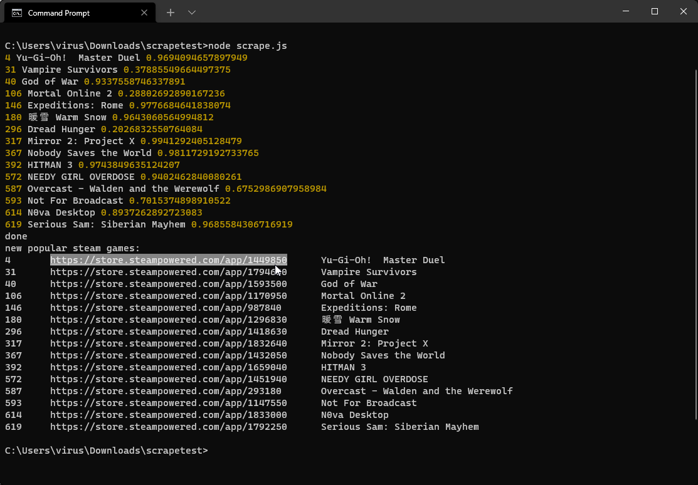

# find-new-games
simple script that scrapes steamcharts.com to find popular and new games.

worth checking every once in a while; espeically if you don't keep up with game news.

~~might be cool to add more sources like twitch.~~ Twitch has been added

## usage
1. make sure python is installed. some module depends on it .-.
2. double click on `find-new-games.bat`

## output (run on 1/28/2022)

## output (run on 2/18/2022)

